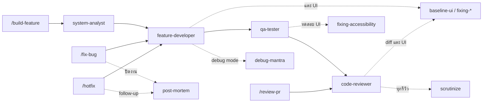
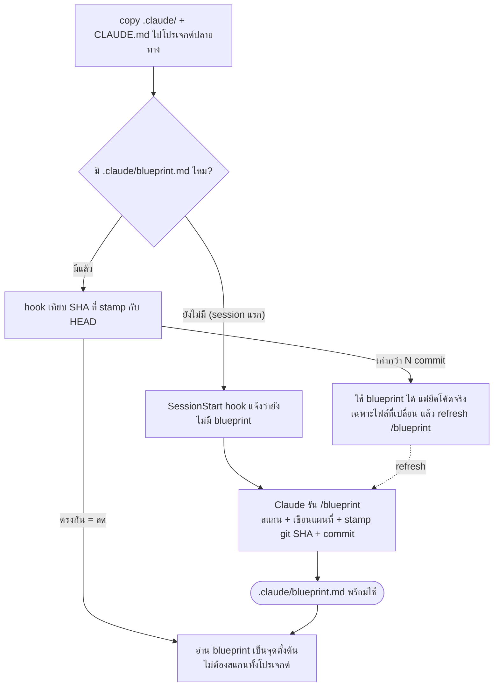

# ชุด Subagent + Slash Command + Skill สำหรับ Claude Code

ชุดเครื่องมือครบวงจรสำหรับงานพัฒนาซอฟต์แวร์ใน Claude Code ประกอบด้วย **subagent เฉพาะทาง 6 ตัว**, **slash command 12 คำสั่ง** ที่เรียกใช้ agent เหล่านั้นตามสูตรที่เหมาะกับแต่ละสถานการณ์ และ **skill 9 ตัว** (vendor จาก [9arm-skills](https://github.com/thananon/9arm-skills) + [ui-skills](https://github.com/ibelick/ui-skills)) ที่ผูกเข้ากับ agent/command บางตัวและ auto-trigger ตามบริบท ทุกขั้นตอนเขียนสรุปเป็นไฟล์ `.md` และสื่อสารกับคุณเป็นภาษาไทย

ชุดนี้ออกแบบให้เป็น **template สำหรับ copy `.claude/` ไปวางในโปรเจกต์อื่น** — เมื่อวางแล้วมันจะ **ตั้งตัวเองอัตโนมัติ** ผ่านระบบ [Project Blueprint](#project-blueprint-แผนที่โปรเจกต์--ลด-context) ที่สร้างแผนที่โปรเจกต์ปลายทางและดูแลความสดให้เอง เพื่อลด context ที่เสียไปกับการสแกนไฟล์ซ้ำๆ ทุก session

---

## Subagent (6 ตัว)

| Agent | หน้าที่ | สิทธิ์ |
|---|---|---|
| `system-analyst` | วิเคราะห์ requirement เขียน spec + API contract | อ่าน + เขียนสรุป |
| `feature-developer` | เขียนโค้ด/แก้บั๊ก/refactor ตาม spec | อ่าน/เขียน/แก้/รันคำสั่ง |
| `qa-tester` | ทดสอบ หา bug (ไม่แก้โค้ดเอง) | อ่าน/รันคำสั่ง/เขียนสรุป |
| `code-reviewer` | รีวิวคุณภาพ + security (ไม่แก้โค้ดเอง) | อ่าน/รันคำสั่ง/เขียนสรุป |
| `code-explainer` | อธิบายว่าโค้ด/ระบบทำงานยังไง | อ่าน/รันคำสั่ง/เขียนสรุป |
| `pipeline-state` | ดูแลไฟล์สถานะ pipeline สำหรับ pause/resume (ตัวช่วย ไม่เรียกตรง) | อ่าน/เขียน |

---

## Slash Command (12 คำสั่ง)

พิมพ์ชื่อคำสั่งตามด้วยคำอธิบาย แล้วที่เหลือทำงานเอง

| คำสั่ง | ใช้เมื่อ | Agent ที่เกี่ยวข้อง | จุดหยุดตรวจ (GATE) |
|---|---|---|---|
| `/blueprint` | สร้าง/อัปเดตแผนที่โปรเจกต์ (`.claude/blueprint.md`) | — | — |
| `/build-feature` | สร้างฟีเจอร์ใหม่ตั้งแต่ต้น | ครบทั้ง 4 ตัว | ตรวจ spec ก่อน dev |
| `/fix-bug` | แก้บั๊ก | dev + qa | ยืนยัน root cause ก่อนแก้ |
| `/hotfix` | แก้ด่วนขึ้น production | dev (diagnose + fix/verify ในตัวเดียว) | ยืนยันก่อนแตะ production |
| `/refactor` | ปรับโครงสร้างโค้ด (พฤติกรรมเดิม) | dev + qa (baseline รัน inline) | เช็ค test coverage ก่อน |
| `/write-tests` | เขียน test ให้โค้ดที่ยังไม่มี | qa + dev (+qa ถ้างานใหญ่) | ตรวจ test plan ก่อนเขียน |
| `/review-pr` | รีวิวโค้ดที่มีอยู่ (PR/branch/commit) | code-reviewer | — |
| `/security-audit` | ตรวจความปลอดภัยเชิงลึก | code-reviewer (security) | — |
| `/explain` | อธิบายว่าโค้ดส่วนนี้ทำงานยังไง | code-explainer | — |
| `/spec-only` | ออกแบบ spec อย่างเดียว ไม่เขียนโค้ด | system-analyst | — |
| `/pause` | หยุดงานที่ทำอยู่ บันทึกสถานะไว้ | pipeline-state | — |
| `/resume` | กลับมาทำงานที่ pause ไว้ต่อ | pipeline-state + ตัวที่ค้าง | ยืนยันก่อนทำต่อ |

---

## Skill (9 ตัว)

Skill คือชุดแนวทางเฉพาะทางที่ Claude หยิบมาใช้ระหว่างทำงาน — vendor มาจาก [thananon/9arm-skills](https://github.com/thananon/9arm-skills) และ [ibelick/ui-skills](https://github.com/ibelick/ui-skills) เก็บไว้ใน `.claude/skills/` (รายละเอียดเต็มดู [`.claude/skills/README.md`](.claude/skills/README.md))

| Skill | ทำอะไร (อ่านแล้วเข้าใจเลย) | ใช้ตอนไหน |
|---|---|---|
| `debug-mantra` | บังคับวินัยตอนไล่บั๊ก: ทำให้บั๊กเกิดซ้ำได้ก่อน → หาจุดที่พังจริง → ตั้งสมมติฐานแล้วลองพิสูจน์ว่ามัน "ผิด" → ค่อยแก้ กันการเดาสุ่มแล้วแก้มั่ว | เริ่ม debug, มีบั๊ก, เจอ error/stack trace |
| `post-mortem` | หลังแก้บั๊กเสร็จ เขียนสรุปว่า "ต้นเหตุคืออะไร แก้ยังไง ทดสอบยังไง แล้วทำไมมันหลุดมาได้" ให้คนอื่น (หรือตัวเราในอีก 6 เดือน) เข้าใจเร็ว | หลังปิดบั๊กที่ยืนยันว่าหายจริงแล้ว |
| `scrutinize` | รีวิวแบบคนนอก: ถามก่อนว่า "จำเป็นต้องทำแบบนี้ไหม มีวิธีง่ายกว่าไหม" แล้วไล่โค้ดจริงว่าทำได้อย่างที่อ้าง ไม่ใช่ดูแค่ diff | รีวิว PR/แผน/โค้ด, อยากได้ second opinion |
| `management-talk` | แปลงเรื่องเทคนิคให้ผู้บริหารอ่านรู้เรื่อง: ตัดศัพท์โค้ดออก เหลือ "เกิดอะไร กระทบลูกค้ายังไง ใครดูแล ต่อไปทำอะไร" แล้วจัดรูปตามช่องทาง | ต้องรายงานขึ้นหัวหน้า/exec, ทำ status update, เขียน Slack/อีเมล |
| `stay-on-track` | กันงานยาวๆ ไม่ให้หลง: จับตอนวนทำซ้ำที่เดิม / คิดเยอะแต่ไม่ลงมือ / context กำลังจะเต็ม แล้วสั่งพักงานด้วย `/pause` ให้กลับมาทำต่อได้ | งานหลาย step ยาวๆ, รู้สึกวน/ติด/ทำซ้ำ |
| `baseline-ui` | เก็บกวาด UI ที่ AI ทำออกมาดู "มั่ว": จัดระยะห่าง ลำดับความสำคัญ ตัวหนังสือ และ layout ให้เรียบร้อยตามมาตรฐาน | ทำ/ขัดเกลา UI, อยากให้หน้าตาเนี้ยบขึ้น |
| `fixing-accessibility` | ตรวจ+แก้ให้ทุกคนใช้งานได้: ปุ่มมีชื่อให้ screen reader อ่าน, กดคีย์บอร์ด/Tab ได้, โฟกัสถูกที่, สีตัดกันพอ, ฟอร์มบอก error ชัด | เพิ่มปุ่ม/ฟอร์ม/dialog, เช็ก WCAG |
| `fixing-metadata` | ตรวจ+แก้ meta ของหน้าเว็บ: title, คำอธิบาย, canonical, การ์ดตอนแชร์ (OG/Twitter), favicon, JSON-LD ให้ SEO และ preview ตอนแชร์ถูกต้อง | ทำหน้าใหม่, แก้ SEO / preview ตอนแชร์ลิงก์ |
| `fixing-motion-performance` | ตรวจ+แก้ animation ที่กระตุก: เลี่ยงการไปกวน layout, ใช้ property ที่ลื่น (transform/opacity), ไม่ผูก animation กับ scroll โดยตรง | animation หน่วง/กระตุก, รีวิว performance ของ motion |

> **ที่มา:** `debug-mantra`, `post-mortem`, `scrutinize`, `management-talk`, `stay-on-track` มาจาก [9arm-skills](https://github.com/thananon/9arm-skills) · `baseline-ui`, `fixing-accessibility`, `fixing-metadata`, `fixing-motion-performance` มาจาก [ui-skills](https://github.com/ibelick/ui-skills)

**การผูกกับ agent (deterministic):**

| Agent / Command | Skill ที่เรียก | เมื่อไหร่ |
|---|---|---|
| `code-reviewer` | `scrutinize` + UI skills (`fixing-*`, `baseline-ui`) | ทุกครั้งก่อนสรุปรีวิว / เมื่อ diff แตะ UI |
| `feature-developer` | `debug-mantra` / UI skills | โหมดวินิจฉัยบั๊ก / เมื่อโค้ดแตะ UI |
| `qa-tester` | `fixing-accessibility` | เมื่อทดสอบ UI |
| `/fix-bug`, `/hotfix` | `debug-mantra`, `post-mortem` | ระหว่าง/หลังแก้บั๊ก |

Skill ที่เหลือ (เช่น `management-talk`) จะ auto-trigger จาก `description` ใน conversation หลัก หรือเรียกด้วย `/skill-name` เอง

**แผนภาพ: command → agent → skill** (เส้นทึบ = ลำดับ pipeline, เส้นประ = การเรียก skill ตามเงื่อนไข)



> **หมายเหตุ:** subagent จะเรียก skill ได้ต่อเมื่อมี `Skill` อยู่ในช่อง `tools:` ของ frontmatter — 3 agent ที่ผูกไว้ (`code-reviewer`, `feature-developer`, `qa-tester`) ถูกเพิ่มให้แล้ว

---

## วิธีติดตั้ง

คัดลอกไฟล์เข้าโครงสร้างนี้ในโปรเจกต์ (agent กับ command อยู่คนละโฟลเดอร์):

```
.claude/
  agents/
    system-analyst.md
    feature-developer.md
    qa-tester.md
    code-reviewer.md
    code-explainer.md
    pipeline-state.md
  commands/
    build-feature.md
    fix-bug.md
    hotfix.md
    refactor.md
    write-tests.md
    review-pr.md
    security-audit.md
    explain.md
    spec-only.md
    pause.md
    resume.md
    blueprint.md
  hooks/
    blueprint-check.sh
  settings.json          # ลงทะเบียน SessionStart hook (blueprint-check)
  CLAUDE.md              # กฎ cross-cutting (โหลดผ่าน ./CLAUDE.md ที่ @import)
  skills/
    README.md
    debug-mantra/SKILL.md
    post-mortem/SKILL.md
    scrutinize/SKILL.md
    management-talk/SKILL.md
    baseline-ui/SKILL.md
    fixing-accessibility/SKILL.md
    fixing-metadata/SKILL.md
    fixing-motion-performance/SKILL.md
```

Claude Code จะตรวจพบไฟล์อัตโนมัติภายในไม่กี่วินาที (ถ้าโฟลเดอร์เพิ่งสร้างใหม่ตอน session เปิดอยู่ ให้ปิด-เปิดใหม่หนึ่งครั้ง) โฟลเดอร์ `.claude/reports/` ไม่ต้องสร้างเอง — agent สร้างให้ตอนเขียนไฟล์สรุปครั้งแรก

### เริ่มใช้ในโปรเจกต์ใหม่ (ทีละขั้น)

1. คัดลอกโฟลเดอร์ `.claude/` **และไฟล์ `CLAUDE.md` ที่ root** ไปวางที่ root ของโปรเจกต์คุณ
2. (ทางเลือก) ทำให้ hook รันได้: `chmod +x .claude/hooks/blueprint-check.sh`
3. เปิด session ใหม่ใน Claude Code → SessionStart hook จะแจ้งว่ายังไม่มี blueprint
4. พิมพ์ `/blueprint` — หรือแค่เริ่มสั่งงานแรก แล้ว Claude จะสร้างให้เองตามกฎใน `CLAUDE.md` → ได้ `.claude/blueprint.md` + commit อัตโนมัติ
5. สั่งงานได้ตามปกติ เช่น `/build-feature ...`, `/fix-bug ...`, `/explain ...`
6. session ถัดไป (คนละวัน/เปิดใหม่) → Claude อ่าน blueprint เป็นแผนที่แทนการสแกนทั้งโปรเจกต์ และ hook จะบอกว่าแผนที่ยัง "สด" ไหม

> ถ้าต้องการ dev backend/frontend คู่ขนาน ให้เปิด flag Agent Team ใน `settings.json` (ดูส่วน [Agent Team](#agent-team-ให้-dev-ทำ-backend--frontend-คู่ขนาน)) — subagent มี `Skill` tool ให้แล้วใน template จึงเรียก skill ที่ผูกไว้ได้ทันที

---

## Project Blueprint (แผนที่โปรเจกต์ — ลด context)

เมื่อ copy `.claude/` ไปวางในโปรเจกต์อื่น ชุดนี้จะสร้างและดูแล **แผนที่โปรเจกต์** ที่ `.claude/blueprint.md` ให้อัตโนมัติ เพื่อให้แต่ละ session **อ่านแผนที่แทนการสแกนทั้งโปรเจกต์** — ลด context ที่เสียไปกับการค้นหาไฟล์ซ้ำๆ

### ทำงานยังไง



### 3 ชิ้นส่วน

| ไฟล์ | บทบาท |
|---|---|
| `.claude/commands/blueprint.md` | คำสั่ง `/blueprint` — สแกน/refresh แผนที่ (โครงสร้าง, tech stack, entry points, "อยากได้ X ดูที่ไหน") พร้อม stamp `blueprint-sha` |
| `.claude/hooks/blueprint-check.sh` | SessionStart hook — เทียบ SHA ที่ stamp กับ HEAD แล้ว inject สถานะความสด (สด / เก่ากว่า N commit + ลิสต์ไฟล์ที่เปลี่ยน) เข้า context |
| `.claude/settings.json` | ลงทะเบียน hook เข้า `SessionStart` |

### ทำไมปลอดภัย (ไม่หลอกให้เชื่อแผนที่เก่า)

- blueprint stamp **git SHA** ตอนสร้าง → hook เทียบกับ HEAD ทุก session
- ถ้าเก่า hook จะบอก **เฉพาะไฟล์ที่เปลี่ยน** และสั่งให้ยึดโค้ดจริงเหนือ blueprint เฉพาะส่วนนั้น
- `/blueprint` แบบ refresh อัปเดตเฉพาะส่วนที่ SHA เปลี่ยน ไม่สแกนใหม่ทั้งก้อน

> **หมายเหตุ:** repo template นี้เอง (ไฟล์ markdown ไม่กี่ตัว) ไม่จำเป็นต้องมี blueprint — README + `.claude/CLAUDE.md` ทำหน้าที่แผนที่อยู่แล้ว กลไกนี้ออกแบบมาเพื่อ **โปรเจกต์ปลายทางที่ copy ไปใช้**

---

## ตัวอย่างการใช้แต่ละคำสั่ง

### `/blueprint` — สร้าง/อัปเดตแผนที่โปรเจกต์
```
/blueprint
```
รัน: **ครั้งแรก** สแกนโครงสร้างโปรเจกต์ เขียน `.claude/blueprint.md` (ภาพรวม, tech stack, โครงสร้างหลัก, entry points, คำสั่งสำคัญ, "อยากได้ X ดูที่ไหน", conventions) พร้อม stamp git SHA แล้ว commit เฉพาะไฟล์นั้น; **ครั้งถัดไป** เป็น refresh — อัปเดตเฉพาะส่วนที่ไฟล์เปลี่ยนตั้งแต่ SHA เดิม ไม่สแกนใหม่ทั้งก้อน

โฟกัสเฉพาะส่วนได้:
```
/blueprint src/payment
```

### `/build-feature` — สร้างฟีเจอร์ใหม่
```
/build-feature ระบบล็อกอินด้วยอีเมล/รหัสผ่าน รองรับ reset password และจำกัดล็อกอินผิด 5 ครั้ง
```
รัน: วิเคราะห์ → **หยุดให้ตรวจ spec** → พัฒนา (เลือก dev เดี่ยว/คู่ขนานเองตามขนาดงาน — ดูส่วน Agent Team) → ทดสอบ → รีวิว

### `/fix-bug` — แก้บั๊ก
```
/fix-bug กดปุ่ม submit ฟอร์มแล้วขึ้น 500 เฉพาะตอนที่ช่องหมายเหตุมี emoji
```
รัน: reproduce + หา root cause → **หยุดยืนยัน root cause** → แก้ + เขียน regression test → qa ยืนยันหาย

### `/hotfix` — แก้ด่วน production
```
/hotfix production ล่ม หน้า checkout error ตั้งแต่ deploy รอบล่าสุด สงสัยที่ payment service
```
รัน: วินิจฉัยเร็ว เสนอ fix เล็กสุด → **หยุดยืนยันก่อนแตะ production** → แก้ + smoke test + verify แบบ scoped (dev ตัวเดิม ไม่ spawn qa แยกเพื่อความเร็ว)

### `/refactor` — ปรับโครงสร้าง
```
/refactor แยกฟังก์ชัน processOrder ที่ยาว 300 บรรทัดใน orderService.js ให้เป็นฟังก์ชันย่อยที่อ่านง่าย
```
รัน: เช็ค test baseline (orchestrator รันเอง) → **หยุดเช็ค coverage** → refactor (พฤติกรรมห้ามเปลี่ยน) → qa ยืนยันเหมือนเดิม

### `/write-tests` — เพิ่ม test
```
/write-tests เขียน unit test ให้ utils/dateFormatter.js ที่ตอนนี้ยังไม่มี test เลย
```
รัน: qa วางแผนว่าควรทดสอบอะไร → **หยุดตรวจ test plan** → dev เขียน test → qa ตรวจว่า test มีความหมาย (เฉพาะงานใหญ่ งานเล็ก orchestrator ตรวจเอง)

### `/review-pr` — รีวิวโค้ดที่มีอยู่
```
/review-pr รีวิว branch feature/payment-refund เทียบกับ main
```
รัน: หา diff → code-reviewer รีวิวจัดลำดับความสำคัญ (Critical/Warning/Suggestion)

### `/security-audit` — ตรวจความปลอดภัย
```
/security-audit ตรวจส่วน authentication และ API endpoints ทั้งหมด
```
รัน: code-reviewer โหมด security ไล่ injection, auth flaw, secrets, ฯลฯ จัดลำดับตาม severity

### `/explain` — อธิบายโค้ด
```
/explain อธิบายว่าระบบ authentication ในโปรเจกต์นี้ทำงานยังไงตั้งแต่ login จน session หมดอายุ
```
รัน: code-explainer สำรวจ + อธิบายสถาปัตยกรรม, data flow, จุดสำคัญ เป็นภาษาไทย

### `/spec-only` — ออกแบบอย่างเดียว
```
/spec-only ออกแบบระบบ notification แบบ real-time แต่ยังไม่ต้องเขียนโค้ด อยากดู spec ก่อน
```
รัน: system-analyst เขียน spec เต็ม แล้วหยุด (ต่อด้วย `/build-feature` ทีหลังได้)

### `/pause` — หยุดงานไว้ก่อน
```
/pause ต้องไปประชุม เดี๋ยวกลับมาทำ qa ต่อ
```
รัน: บันทึกสถานะปัจจุบันลง `_state.json` (ทำถึงขั้นไหน เหลืออะไร context อะไรค้าง) แล้วบอกว่ากลับมาใช้ `/resume` ได้

### `/resume` — กลับมาทำต่อ
```
/resume
```
รัน: อ่าน `_state.json` + ไฟล์สรุปทั้งหมด → สรุปให้ดูว่าค้างตรงไหน → **ยืนยันก่อนทำต่อ** → เดิน pipeline ต่อจากจุดเดิม (ใช้ได้แม้เปิด session ใหม่คนละวัน)

---

## Agent Team: ให้ dev ทำ backend + frontend คู่ขนาน

โดยปกติ `feature-developer` จะทำงานทีละอย่าง (sequential) แต่ถ้างานมีทั้ง backend และ frontend เป็นชิ้นใหญ่พอๆ กัน สามารถให้ dev สองตัวทำ**พร้อมกัน**และ**คุยกันเองระหว่างทาง**ได้ ด้วยฟีเจอร์ Agent Team ของ Claude Code

### ต่างจาก subagent ปกติยังไง

| | Subagent ปกติ | Agent Team |
|---|---|---|
| การทำงาน | ทีละตัว ส่งผลกลับ | หลายตัวพร้อมกัน |
| การสื่อสาร | รายงานกลับตัวสั่งเท่านั้น | teammate คุยกันเองได้ |
| เหมาะกับ | งาน sequential (bug, review, spec) | backend/frontend คู่ขนานที่ต้อง sync API contract |
| ค่าใช้จ่าย | ต่ำ | สูงกว่า (แต่ละตัวมี context แยกเต็ม) |

### ขั้นตอนที่ 0: เปิดใช้งานก่อน (จำเป็น)

Agent Team เป็น experimental feature ปิดไว้เป็น default ต้องเปิดใน `.claude/settings.json`:

```json
{
  "env": {
    "CLAUDE_CODE_EXPERIMENTAL_AGENT_TEAMS": "1"
  }
}
```

> ถ้าไม่เปิดตัวนี้ `/build-feature` จะ fallback ไปทำ backend ก่อนแล้วค่อย frontend แบบ sequential แทน (ยังทำงานได้ แค่ไม่ขนาน)

### วิธีที่ 1: ผ่าน `/build-feature` (อัตโนมัติ)

เมื่อเปิด Agent Team แล้ว `/build-feature` จะ**ตัดสินใจเองใน Step 2** ว่าจะใช้ agent team หรือไม่:
- งานเล็ก / มีแค่ backend หรือ frontend อย่างเดียว → dev คนเดียว (sequential)
- งานใหญ่มีทั้ง backend + frontend + มี API contract ชัด → สร้าง team `dev-backend` + `dev-frontend` ให้เอง

คุณไม่ต้องทำอะไรเพิ่ม แค่เปิด flag ไว้ Claude จะเลือกโหมดที่เหมาะเอง และแจ้งให้ทราบว่าเลือกโหมดไหนเพราะอะไร

### วิธีที่ 2: เรียก dev คู่ขนานแบบ manual

ถ้าอยากคุมเอง ไม่ผ่าน `/build-feature` ทำตามนี้ (สมมติมี spec จาก system-analyst แล้ว):

```
สร้าง agent team 2 คนโดยใช้ definition ของ feature-developer agent:

teammate "dev-backend": อ่าน spec จาก .claude/reports/{run-folder}/01-system-analyst.md
แล้ว implement เฉพาะส่วน backend ตาม Backend section และ API contract
ทำงานในโฟลเดอร์ src/backend/ พร้อมเขียน unit test ของแต่ละ endpoint

teammate "dev-frontend": อ่าน spec ไฟล์เดียวกัน
แล้ว implement เฉพาะส่วน frontend ตาม Frontend section
เริ่มด้วย mock data ที่ตรงกับ API contract ไปก่อน แล้วค่อยเชื่อมของจริงเมื่อ backend พร้อม
ทำงานในโฟลเดอร์ src/frontend/

ทั้งสองคนต้องส่งข้อความหากันโดยตรงเมื่อ:
- ฝ่ายใดฝ่ายหนึ่งจะเปลี่ยนหรือขอความชัดเจนเรื่อง API contract
- backend ทำ endpoint เสร็จ (แจ้ง frontend ให้เลิกใช้ mock)
- frontend เจอ edge case ที่ contract ไม่ครอบคลุม

ห้ามเปลี่ยน API contract ฝ่ายเดียว ต้องตกลงกันก่อน
แต่ละคนเขียนไฟล์สรุปของตัวเองตามที่ระบุใน agent definition
ใช้ git worktree แยกกันเพื่อกัน conflict
```

จากนั้นปิดทีมก่อนไปขั้น qa:
```
ปิด teammate ทั้งหมด แล้วสรุปว่า backend กับ frontend ทำอะไรไปบ้าง และมีจุดไหนเบี่ยงจาก API contract หรือไม่
```
แล้วต่อด้วย qa-tester และ code-reviewer ตามปกติ

### ข้อควรรู้ / ข้อจำกัด

- **teammate ไม่ได้รับ conversation history มา** — ต้องบอก context ที่จำเป็นตอน spawn (สั่งให้อ่าน spec จากไฟล์คือวิธีที่ดีที่สุด)
- **ปิด session แล้วทีมหาย** — `/resume` กู้ teammate ไม่ได้ ต้องสร้างทีมใหม่ (เก็บ spec เป็นไฟล์ช่วยได้มาก)
- **1 session มีได้ 1 ทีม** — ต้องปิดทีมเก่าก่อนสร้างทีมใหม่
- **ใช้ token มากกว่า sequential** — เหมาะเฉพาะงานที่ backend/frontend ใหญ่พอจะคุ้ม ถ้างานเล็กใช้ dev คนเดียวประหยัดกว่า
- **split-pane (เห็นทุก teammate แยกช่อง)** ต้องใช้ terminal ที่รองรับ tmux หรือ iTerm2 (VS Code integrated terminal / Windows Terminal ใช้ split-pane ไม่ได้ แต่ in-process mode ยังใช้ได้ทุก terminal)

---

## Pause / Resume: หยุดงานแล้วกลับมาทำต่อข้าม session

Claude Code ไม่ได้จำสถานะ pipeline ให้อัตโนมัติ — subagent เริ่มใหม่ทุกครั้ง และ session ที่ปิดไปแล้วก็หายหมด ชุดนี้แก้ปัญหานั้นด้วยการ**เก็บสถานะลงไฟล์** `.claude/reports/_state.json`

### ทำงานยังไง

1. ทุก command (โดยเฉพาะ multi-step อย่าง build-feature, fix-bug, refactor, write-tests) เขียน/อัปเดต `_state.json` หลังจบแต่ละ step โดยอัตโนมัติ — บันทึกว่าทำถึงไหน เหลืออะไร และ context สำคัญ
2. พิมพ์ `/pause` เมื่อไหร่ก็ได้ → บันทึกสถานะ + สรุปงานค้างลงไฟล์
3. ปิดเครื่อง/ปิด session ได้เลย ไฟล์ยังอยู่
4. เปิดใหม่วันหลัง พิมพ์ `/resume` → อ่านไฟล์ สร้าง context กลับมา แล้วทำต่อจากจุดเดิม

### หน้าตาไฟล์สถานะ

```json
{
  "workflow": "build-feature",
  "feature": "user-login",
  "status": "paused",
  "current_step": "qa-tester",
  "completed_steps": ["system-analyst", "feature-developer"],
  "pending_steps": ["qa-tester", "code-reviewer"],
  "next_action": "รัน qa-tester ตรวจ implementation",
  "report_dir": ".claude/reports/user-login-20260704-1530/",
  "report_files": [
    ".claude/reports/user-login-20260704-1530/01-system-analyst.md",
    ".claude/reports/user-login-20260704-1530/02-feature-developer-backend.md"
  ],
  "notes": "backend เปลี่ยน field email_verified เป็น isVerified — frontend sync แล้ว",
  "updated_at": "2026-07-03T14:30:00"
}
```

`notes` คือหัวใจของการ resume — เขียนละเอียดพอที่จะเข้าใจงานได้แม้ลืมไปหมดแล้ว

### ข้อควรรู้

- **`/resume` จะยืนยันกับคุณก่อนทำต่อเสมอ** กันกรณีเปลี่ยนใจไปแล้ว
- **GATE ที่ยังไม่ผ่านจะยังหยุดตามเดิม** เช่น resume ก่อนถึงจุดตรวจ spec ก็ยังหยุดให้ตรวจ
- **agent team ไม่ resume ตาม** — ถ้า pause ตอน dev คู่ขนานกำลังทำอยู่ teammate จะหายเมื่อปิด session ต้อง spawn ทีมใหม่ตอน resume (แต่ spec/สรุปที่เขียนไว้ยังอยู่ ทำต่อได้)
- **ทำได้ทีละ workflow** — `_state.json` มีตัวเดียว ถ้าอยากสลับหลายงานพร้อมกันต้องจัดการ state file แยกเอง

---

## ไฟล์สรุปใน `.claude/reports/`

แต่ละ **run จะได้โฟลเดอร์ของตัวเอง** `{feature}-{YYYYMMDD-HHMM}/` เพื่อไม่ให้รายงานของ run ใหม่เขียนทับ run เก่า (แม้เป็น feature ชื่อเดิม หรือรันคนละ command บน feature เดียวกัน) ภายในโฟลเดอร์ชื่อไฟล์คงที่ ไม่ใส่ชื่อ feature ซ้ำ:

```
.claude/reports/
  _state.json                          ← สถานะ pipeline (ไฟล์เดียว อยู่ระดับบนสุดเสมอ สำหรับ pause/resume)
  user-login-20260704-1530/            ← โฟลเดอร์ต่อ run
    01-system-analyst.md
    02-feature-developer-backend.md
    02-feature-developer-frontend.md
    03-qa-tester.md
    04-review.md
  checkout-bug-20260711-0900/          ← อีก run แยกโฟลเดอร์ ไม่ทับกัน
    02-feature-developer-diagnosis.md   ← Step วินิจฉัย (fix-bug/hotfix)
    02-feature-developer-fix.md         ← Step แก้ แยกไฟล์กัน overwrite
    03-qa-tester.md
```

`_state.json` เก็บ `report_dir` (โฟลเดอร์ของ run ปัจจุบัน) และ `report_files` (path เต็มในโฟลเดอร์นั้น) — `/resume` ใช้สองฟิลด์นี้กลับเข้าไปทำต่อในโฟลเดอร์เดิมได้ ส่วน agent ที่ถูกเรียกซ้ำใน run เดียว (dev วินิจฉัย/แก้, qa วางแผน/ตรวจ) จะได้ label ต่อท้ายชื่อไฟล์เพื่อไม่ให้ทับกัน

---

## Troubleshooting (แก้ปัญหาที่พบบ่อย)

| อาการ | สาเหตุที่พบบ่อย | วิธีแก้ |
|---|---|---|
| subagent เรียก skill ไม่ได้ / ไม่ทำตาม skill | ลืมใส่ `Skill` ในช่อง `tools:` ของ agent | เพิ่ม `Skill` เข้า `tools:` ใน `.claude/agents/<agent>.md` |
| SessionStart hook ไม่ทำงาน (ไม่ขึ้นข้อความ blueprint) | ยังไม่ `chmod +x` / path ใน `settings.json` ผิด / ไม่ได้เปิด session ใหม่ | `chmod +x .claude/hooks/blueprint-check.sh`, เช็ค `command` ใน `settings.json` ว่าใช้ `$CLAUDE_PROJECT_DIR`, ปิด-เปิด session |
| hook บอก "หา git SHA ที่ stamp ไม่เจอ" | ไฟล์ไม่มีบรรทัด `<!-- blueprint-sha: ... -->` หรือโฟลเดอร์ไม่ใช่ git repo | รัน `/blueprint` ใหม่ให้ stamp SHA / ตรวจว่าอยู่ใน git repo |
| blueprint ไม่ยอม refresh | ยังไม่มีไฟล์ หรือ SHA ตรงกับ HEAD (ไม่มีอะไรเปลี่ยน) | ปกติ — refresh เมื่อโครงสร้างเปลี่ยนเท่านั้น; บังคับเฉพาะจุดด้วย `/blueprint <path>` |
| dev ไม่ทำงานคู่ขนาน (backend/frontend) | ไม่ได้เปิด flag Agent Team | ตั้ง `CLAUDE_CODE_EXPERIMENTAL_AGENT_TEAMS=1` ใน `settings.json` แล้วเปิด session ใหม่ |
| skill / command / agent ใหม่ไม่โผล่ | โฟลเดอร์สร้างระหว่าง session เปิดอยู่ | ปิด-เปิด session หนึ่งครั้ง |
| `CLAUDE.md` ไม่ถูกโหลด | วางผิดที่ | ต้องมี `./CLAUDE.md` ที่ root (ตัวใน `.claude/` โหลดผ่าน `@import` จาก root) |
| skill ผิดตัวถูกเรียก / ไม่ถูกเรียกทั้งที่ควร | `description` trigger ไม่คมพอ | เรียกตรงด้วย `/skill-name` หรือปรับ trigger ใน `description` ของ skill |
| แก้ mapping skill↔agent แล้วเอกสารไม่ตรงกัน | ลืม sync 3 ที่ | อัปเดต prompt ของ agent + `.claude/skills/README.md` + ตารางใน root README ให้ตรงกัน |

---

## แนวคิดการออกแบบ

- **agent = ความเชี่ยวชาญ, command = สูตรการเรียกใช้** — 12 command ใช้ agent 6 ตัวเดิมซ้ำ แต่เรียงลำดับและตั้งโหมดต่างกันตามสถานการณ์
- **แต่ละ agent ทำเฉพาะหน้าที่ตัวเอง** — qa/reviewer/explainer ไม่แก้โค้ด แค่รายงาน เพื่อให้ผลแต่ละขั้นชัดเจน
- **ประหยัด token — spawn agent เท่าที่จำเป็น** — ทุก subagent เริ่ม context ใหม่ ต้องอ่าน report ซ้ำ = มีต้นทุน จึง: งาน mechanical (รัน test baseline ใน `/refactor`, เขียน `_state.json`) ทำใน orchestrator เอง; `/hotfix` ยุบขั้น verify เข้า dev ตัวเดิมเพื่อความเร็ว; `/write-tests` spawn qa ตรวจคุณภาพเฉพาะงานใหญ่; และ `/fix-bug` ให้ dev ตัวแรกเขียน fix plan ครบ เพื่อให้ dev หลัง GATE ไม่ต้องสำรวจโค้ดซ้ำ
- **GATE หยุดตรวจในจุดเสี่ยง** — spec, root cause, การแตะ production คือจุดที่ผิดแล้วแพง จึงบังคับให้หยุดถามก่อนเสมอ
- **เก็บสถานะลงไฟล์** — `_state.json` ทำให้ pause/resume ข้าม session ได้ เพราะ Claude Code ไม่จำ pipeline ให้เอง
- **สื่อสารภาษาไทย เขียนโค้ด/สรุปตามมาตรฐานสากล**

---

## ปรับแต่งเพิ่มเติม

- **เปลี่ยนที่เก็บ report**: find-replace `.claude/reports/` ในทุกไฟล์ agent
- **แจ้งเตือนอัตโนมัติ**: ตั้ง `SubagentStart`/`SubagentStop` hook ใน `settings.json`
- **เปลี่ยนโมเดล**: แก้ `model:` ในแต่ละ agent (เช่น `haiku` งานเบา, `opus` งานหนัก)
- **เปิด agent team สำหรับ dev คู่ขนาน**: ดูรายละเอียดเต็มในส่วน "Agent Team" ด้านบน (ตั้ง `CLAUDE_CODE_EXPERIMENTAL_AGENT_TEAMS=1` ใน `settings.json`)
